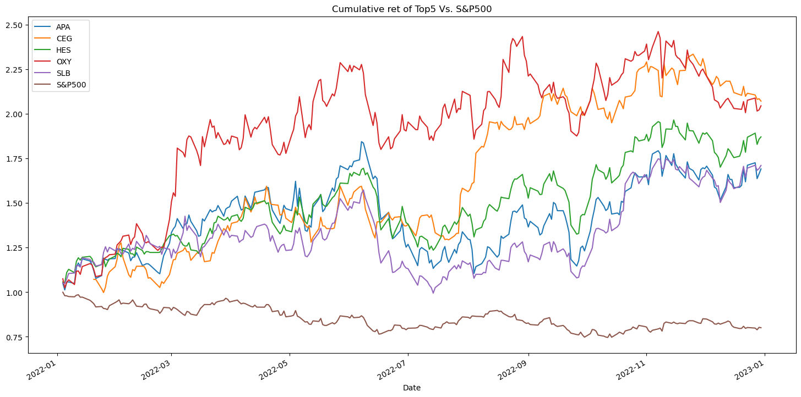

# **Executive Summary: *Inflation Investing in 2022***

## Project Overview
The aim of this project was two-fold. First, we aimed analyze the scope and significance of inflation in 2022. Second, we aimed to analyze inflation impacted securities - specifically I bonds and S&P 500 stocks - and made investing recommendations, based on that analysis. These analyses resulted in eight data visualizations that demonstrate our results:
1. Aggregate Inflation rate Worldwide 2013-2022
2. 2022 Inflation Rate, Expressed as Percentage of 10-Year Mean
3. USA Inflation Rate: Consumer Price Index for All Urban Consumers (CPI-U)
4. I bonds Aggregate Annualized Interest Rate
5. Cumulative Returns of the Top 5 Stocks & S&P 500 Index
6. Rolling Standard Deviation of the Top 5 Stocks & S&P 500 Index
7. Comparison of Total Returns: Top 5 Stocks, S&P 500 Index, and I bonds

## Approach
We essentially divided the task into a data analysis of the inflation indicators and an analysis of stock data between the two members of our group. We created a repository on Github and communicated over Slack and SMS. During class meetings, we discussed to-do lists and progress.

# Analysis: The State of Inflation in 2022
## World Inflation
### Datasets
The following data sources were used to create a merged dataframe:
1. #### "Latitude and Longitude for Every Country and State"
    * Author: Paul Mooney ([Kaggle](https://www.kaggle.com/datasets/paultimothymooney/latitude-and-longitude-for-every-country-and-state))
    * Copyright Information: Attribution-ShareAlike 4.0 International (CC BY-SA 4.0 DEED)
    * Use: This data was used to create a map, plotted with points, based on longitude and latitude
2. #### "Inflation, consumer prices (annual %)"
    * Source: International Monetary Fund, International Financial Statistics and data files ([The World Bank](https://data.worldbank.org/indicator/FP.CPI.TOTL.ZG))
    * Copyright Information: Creative Commons License (CC BY 4.0)
    * Use: This data was used for inflation data by country and year to create two data visualizations: one heatmap bar chart and one plotted point map.
3. #### "ISO-3166-Countries-with-Regional-Codes"
    * Author: Luke Duncalfe ([Github](https://github.com/lukes/ISO-3166-Countries-with-Regional-Codes/blob/master/all/all.csv))
    * Copyright Information: Attribution-ShareAlike 4.0 International (CC BY-SA 4.0 DEED)
    * Use: This data was used more accurately to merge the two dataframes, using ISO-2 and ISO-3 codes.
### Imports
* Pathlib, DateTime, hvPlot, pandas, GeoPandas, Matplotlib, NumPy, Vega-Altair, SciPy
### Other attributed technical resources
* Scipy z-scores: https://docs.scipy.org/doc/scipy/reference/generated/scipy.stats.zscore.html
* Pandas dataframe mask: https://pandas.pydata.org/docs/reference/api/pandas.DataFrame.mask.html
* Altair heatmap example: https://altair-viz.github.io/gallery/annual_weather_heatmap.html
### Results
For both data visualizations, data was first filtered, limited to ten years, ending in 2022.
#### Altair Heatmap Bar Chart
1. **How much did inflation increase across the world in 2022?** First, the data was filtered to remove outliers outside of three standard deviations, relative to the year, using z-scores (SciPy) and the "mask" method. This means that 99.73% of the available data was used to calculate the aggregate inflation rate worldwide, eliminating the impact of failed states on the results. Then, an Altair "2D Histogram Heatmap" was created to show the worldwide inflation rate in 2022 and in relationship to the worldwide inflation rate for the past ten years. A box plot was used to inform the parameters of the heatmap.

    Although statistics showed that the mean inflation in those ten years was approximately 4.3%, the heatmap shows that the inflation rate was most typically around 3.5% before COVID-19 impacted the world economy. The heatmap also shows that inflation was significantly higher at 10.29% in 2022 after rising to 5.59% in 2021.
    

2. **Where did inflation increase significantly?** First, the data was filtered to remove outliers outside of three standard deviations, relative to the country, using z-scores (SciPy) and the "mask" method. This means that 99.73% of the available data was used for calculations, eliminating very irregular data - possibly from periods of civil war, misreporting, etc. From that filtered dataframe, the ten-year mean inflation rate was calculated for each country. Finally, the 2022 inflation rate was expressed, relative to the mean to identify inflation rates that were significant in the context of each country's economy. Those values were plotted (GeoViews), using coordinates, and assigned a color that signifies the significance of each country's inflation rate in 2022. A box plot was used to inform the cmap scale.

    While we had originally intended to use polygons to create this map, we decided to use dot plots because we did not want a granular understanding of inflation or to highlight differences between specific countries. Instead, the map is used to identify regions where inflation increased significiantly: The Americas, West Africa, Europe, The Arabian/Persian Gulf, Southeast Asia, Australasia, and Oceania. In those regionals, most countries experienced an inflation rate in 2022 that was more than 200% of the mean and often much more. The data also demonstrates that countries in Asia and other parts of Africa were less impacted by inflation in 2022, possibly owing to protectionist trade policies and practices.
    

## US Inflation Analysis: Consumer Price Index
### Dataset:
#### "Consumer Price Index for All Urban Consumers (CPI-U): All items in U.S. city average, all urban consumers, seasonally adjusted"
* Source: [Bureau of Labor Statistics Beta Labs](https://beta.bls.gov/dataViewer/view/timeseries/CUSR0000SA0)
* Copyright Information: public domain
* Use: This dataset describes the seasonally-adjusted consumer price index (CPI-U) - a common metric used to measure inflation in the United States.
### Imports:
* Pathlib, DateTime, Pandas, NumPy, hvPlot
### Results:
**How significant was inflation in the United States?** This data was used to create a line graph (hvPlot) that demonstrates how inflation rose sharply in 2022, based on the seasonally adjusted consumer price index for all urban consumers (CPI-U).

This dataset only required that we change the date the DateTime format to create a simpler x-axis on the graph. Other than this manipulation any other dataframe changes were discretionary. In the future, it would probably be better not to make those discretionary changes to the dataframe, but it was personally helpful to eliminate unnecessary columns to identify how other columns would be used.

In this project, the number of graphs we can show is limited, but ideally it would be good to also show a zoomed-in view of the 2019-2023 period.
    

## I bonds Analysis
### Datasets:
1. #### "Series I Bond Rates"
    * Source: Department of the Treasury, Treasury Direct website ([Your Treasury Direct](https://www.yourtreasurydirect.com/rates/ibonds))
    * Copyright Information:
        * The dataset is composed of data from the Treasury, and that data is public domain.
        * Your Treasury Direct - a for-profit company - states that "You may not access or use the Services for any purpose other than that for which we make the Services available. The Services may not be used in connection with any commercial endeavors except those that are specifically endorsed or approved by us. As a user of the Services, you agree not to: Systematically retrieve data or other content from the Services to create or compile, directly or indirectly, a collection, compilation, database, or directory without written permission from us." *Essentially, this for-profit website is using public domain information from the federal government and can, therefore, make no specific claims to the data itself. Ideally, the Treasury's website would have made a CSV file, but we were not able to locate one for I bonds, specifically.*
    * Use: This dataset  - a CSV file - describes six-month I bond return rates, including the fixed interest rate and the variable interest rate. 
2. #### "SERIES I SAVINGS BOND EARNINGS RATES EFFECTIVE NOVEMBER 1, 2023"
    * Publisher: [Treasury Direct](https://treasurydirect.gov/files/savings-bonds/i-bond-rate-chart.pdf)
    * Source: Department of the Treasury, Treasury Direct website
    * Copyright Information: public domain
    * Use: This data (a table on a PDF) was used to fill in missing data from the original CSV
### Imports:
* Pathlib, DateTime, pandas, Matplotlib, NumPy, hvPlot
### Technical notes:
* The variable interest rate was annualized from the given 6-month rate to perform the analysis.
* There were errors and omissions in the dataset (CSV) that needed to be corrected, using the table from the Treasury.
### Results:
**How did inflation impact the I bond market, a risk-free investment for retail investors?** I bond interest rates are determined by a fixed rate and a variable rate. The variable rate is equal to the The variable interest rate is the inflation rate, preceding that six-month period. This dataset was used to create a stacked bar chart (hvPlot), showing how I bond interest rates and inflation were significantly higher in 2022 than previous years. Based on this correlation, we can see the inflation rate itself and I bond interest rates, peaking at almost 10% in 2022. This, in turn, gave investors a high risk-free rate in 2022 - an alternative to investing in equity markets. This chart also demonstrates that inflation and I bond interest rates have not been reduced to levels from before the pandemic, continuing to make I bonds an attractive investment for consumers.

# Stock and Index Analysis
### Datasets:
1. Yahoo Finance API
    * Copyright: "Subject to your compliance with all the terms and conditions of this Agreement, Yahoo grants you a non-exclusive, non-transferable, non-sublicensable right and license to access and use the Yahoo APIs, solely using your own Yahoo API Credentials or Yahoo API Credentials that you are expressly authorized to use, and solely for the purposes of: (i) developing a Yahoo API Client; or (ii) managing a Yahoo commercial account via the Yahoo API Client that you are expressly authorized to manage and access."
    * Use: This API is used for historical stock data.
2. "List of S&P 500 Companies"
    * Publisher: [Wikipedia](https://en.wikipedia.org/wiki/List_of_S%26P_500_companies)
    * Copyright: Creative Commons Attribution-ShareAlike License 4.0
### Imports:
* Pandas, Datetime, Numpy, Pathlib, Matplotlib, yfinance API
### Process & Results
The second aim of our project is to analyze how stocks performed in 2022 – a period of high inflation and interest rates, specifically Ibonds for retail savers. This was done by accessing stocks in the S&P 500 using yfinance API tool, using a list of S&P 500 stocks from Wikipedia. Data preprocessing and cleaning was then executed for easier readability. Next, we derived the top 5 stocks that performed exceptionally during this time period.

**Which stocks in the S&P 500 performed the best?**

In no particular order the following stocks occupied the top seat:
* NVR - NVR Inc ( operates as a homebuilder in the United States. The company operates through, Homebuilding and Mortgage Banking segments.)
* BKNG - Booking Holdings ( provides travel and restaurant online reservation and related services worldwide.)
* AZO - Autozone Inc (retails and distributes automotive replacement parts and accessories in the United States, Mexico, and Brazil.)
* CMG - Chipotle Mexican Grill, Inc ( together with its subsidiaries, owns and operates Chipotle Mexican Grill restaurants.)
* MTD - Mettler-Toldeo International (manufactures and supplies precision instruments and services in the United States and internationally.)

**How did the S&P 500 perform?** Cumulative returns which aggregates the loss and gain over a period of time calculation was implemented to get a closer picture as to how the Top 5 stocks performed using the S&P500 as a benchmark. Over the period, S&P 500 cumulative returns remain steady where as MTD growth had an upward momentum with NVR experiencing a lower growth rate.

**How risky was the equity market?** To measure the volatility of the stocks, a standard deviation calculation was done over a rolling window of 21 days, to access risk NVR and BKNG far exceeded the S&P 500 as a whole. This could be to the fact these stocks are cyclical and for that matter the probability if investing in these stocks at the time period was quite a risky move.

**Compare the index, top performers, and I bonds as options for investments for retail investors.**
To see how these stocks did in comparison with the I bonds, a sharpe ratio calculation was made:
I bonds resulted in a sharpe ratio of 23.24 annualized 6-month variable interest rate and a 26.63 (aggregate annualized interest rate),
* S&P 500 (as a benchmark) - 222.94
* CMG - 192.34
* AZO - 176.23
* MTD - 168.95
* NVR - 166.99
* BKNG - 134.75

To risk investing in these stocks means you risk to reward ratio will be quite rewarding not forgetting the risk associated with these stocks. I bonds on the otherhand, maintain a sharpe of 23.24 (annualized six-month variable interest rate) and 26.63 (aggregate annualized interest rate).
    

### Limitations & Plans For Future Research and Development:
The limitation I faced with comparing the stocks and I bonds is the fact that the sharpe ratio remained constant for the I bonds while the Top5 and S&P 500 had fluctuating sharpe ratio. What I would loved to do was to implement the Monte Carlo Simulation, using the an initial investment and short term investment of about 1-2 years to determine if there were any form of changes between the stock and the I-bonds - will the stock returns still have higher returns than the I-bonds? Would the I-bonds beat the Top5 and S&P 500 benchmark? Should 

### Conclusion:
From the analysis, the top5 stocks outperformed the I-bonds with a sharpe ratio for I bond remaining constant throughout. I'd recommend a risk-tolerant individual who wants to invest a heavily percentage of his or her money in stocks and the remaining in I-bonds for diversification purposes, since the risk to reward ratio is much higher than that of the I-bonds. For a risk averse person, maybe investing heavily in the I-bonds and a portion of the money is the stocks will be appropriate.  